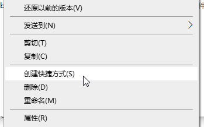
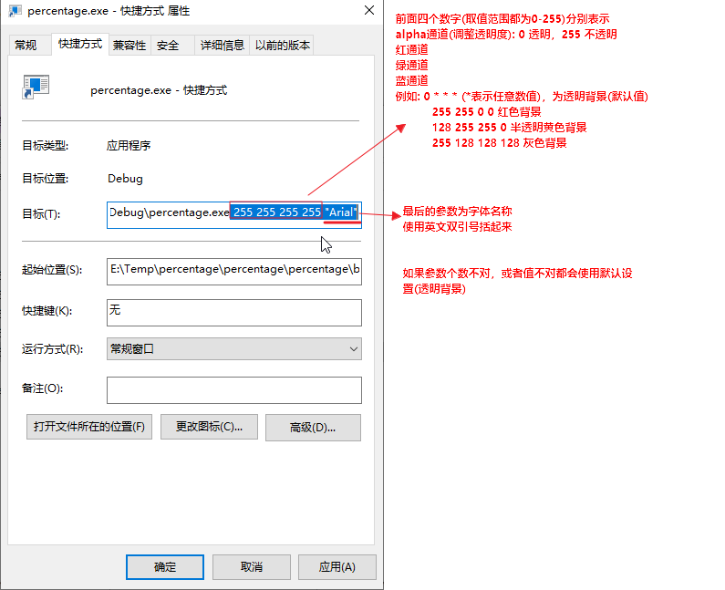

# percentage

See your battery percentage in the Windows 10 system tray

## Installing

* Put `percentage.exe` in your startup folder
  * To get to your startup folder, press `Windows+R`, type `shell:startup`, and press enter

## Compiling

This project was compiled with Visual Studio Professional 2015.

## Contributing

I created this project with a very basic understanding of developing C# desktop applications and contributions are extremely welcome!

---

## 补充说明-如何使用自定义背景色及字体

[Download the latest release](https://github.com/chengdong0421/percentage/releases)

### 1.直接双击程序即使用透明背景色

### 2.自定义背景色和字体

右键程序，在右键菜单中点击“创建快捷方式”  

再在生成的快捷方式上右键，在右键菜单上点击"属性",打开属性对话框

按下图添加参数,设置好后点击确定，双击快捷方式即可将背景色设置为自定义颜色

